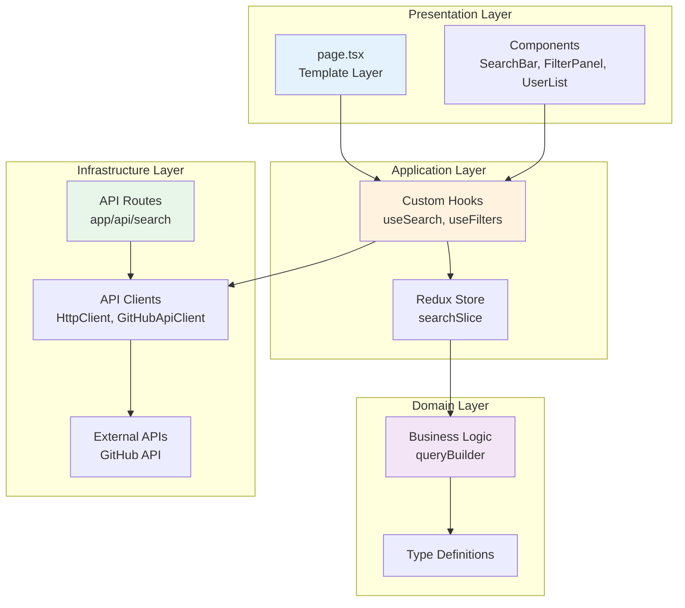
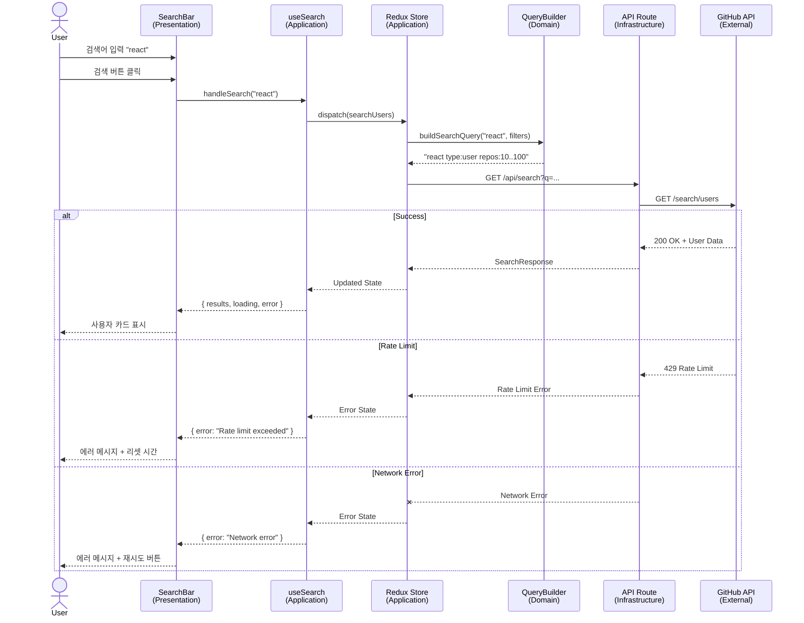
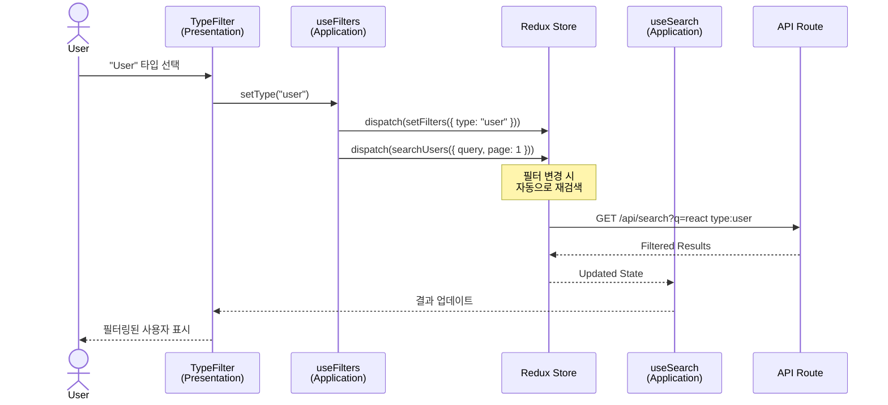

# GitHub User Search

> 고급 필터링 기능을 갖춘 GitHub 사용자 검색 애플리케이션

[](https://nextjs.org/)
[](https://reactjs.org/)
[](https://www.typescriptlang.org/)
[](https://mui.com/)
[](https://redux-toolkit.js.org/)
[](https://www.cypress.io/)
[](https://jestjs.io/)

## 📋 목차

- [프로젝트 소개](#-프로젝트-소개)
- [주요 기능](#-주요-기능)
- [기술 스택](#-기술-스택)
- [시작하기](#-시작하기)
- [프로젝트 구조](#-프로젝트-구조)
- [아키텍처](#-아키텍처)
- [구현 스펙](#-구현-스펙)
- [테스트](#-테스트)
- [스타일링 가이드](#-스타일링-가이드)
- [환경 변수](#-환경-변수)
- [API 문서](#-api-문서)
- [트러블슈팅](#-트러블슈팅)

---

## 🚀 프로젝트 소개

GitHub User Search는 GitHub API를 활용하여 사용자와 조직을 검색하고, 다양한 필터를 적용할 수 있는 웹 애플리케이션입니다. Clean Architecture와 Feature-based Modularity 패턴을 적용하여 확장 가능하고 유지보수가 용이한 구조로 설계되었습니다.

### ✨ 프로젝트 특징

- **Clean Architecture**: Layer 분리 (Presentation, Application, Domain, Infrastructure)
- **Feature-based Modularity**: 기능별 독립적 모듈 구성
- **TDD (Test-Driven Development)**: 단위 테스트 우선 개발
- **E2E Testing**: Cypress를 활용한 사용자 시나리오 테스트
- **Type Safety**: TypeScript Strict Mode로 타입 안정성 보장

---

## 🎯 주요 기능

### 검색 기능
- **기본 검색**: GitHub 사용자명, 이름, 이메일로 검색
- **실시간 검색**: 검색어 입력 시 즉시 결과 표시
- **검색 히스토리**: 이전 검색어 유지

### 필터링 (구현 중)
- ✅ **타입 필터**: User/Organization 구분
- ✅ **검색 필드**: Login/Name/Email 선택
- ✅ **리포지토리 수**: 최소/최대 범위 지정
- 🚧 **위치**: 지역별 검색
- 🚧 **언어**: 주 사용 언어 필터링
- 🚧 **계정 생성일**: 날짜 범위 지정
- 🚧 **팔로워 수**: 최소/최대 범위 지정
- 🚧 **후원 가능 여부**: Sponsorable 필터

### 결과 표시
- **사용자 카드**: 아바타, 이름, 타입, Bio, 위치, 회사
- **상세 정보**: 팔로워 수, 리포지토리 수
- **무한 스크롤**: 자동 페이지네이션
- **GitHub 링크**: 프로필 페이지로 이동

### 에러 핸들링
- **Rate Limit**: API 제한 시 리셋 시간 표시
- **네트워크 에러**: 재시도 기능 제공
- **빈 결과**: 안내 메시지 표시

---

## 🛠 기술 스택

### Core
- **Next.js 14.2.15**: React 프레임워크 (App Router)
- **React 18.3.1**: UI 라이브러리
- **TypeScript 5.x**: 정적 타입 체크

### State Management
- **Redux Toolkit 2.0**: 상태 관리
- **React Redux 9.0**: React-Redux 바인딩

### UI Framework
- **MUI (Material-UI) 6.1.7**: 컴포넌트 라이브러리
- **Emotion 11.13**: CSS-in-JS
- **Tailwind CSS 3.4.1**: 유틸리티 CSS

### Testing
- **Jest 29.7**: 단위 테스트 프레임워크
- **React Testing Library 16.0**: 컴포넌트 테스트
- **Cypress 13.15**: E2E 테스트

### Development Tools
- **ESLint 8.x**: 코드 린팅
- **Prettier 3.3.3**: 코드 포맷팅
- **pnpm**: 패키지 매니저

---

## 🚀 시작하기

### 필수 요구사항

- **Node.js**: >= 18.0.0
- **pnpm**: >= 8.0.0
- **GitHub Token**: API 인증용 (선택사항, Rate Limit 증가)

### 설치 및 실행

#### 1. 저장소 클론

```bash
git clone https://github.com/bulhwi/github-user-search-fe.git
cd github-user-search-fe
```

#### 2. 의존성 설치

```bash
pnpm install
```

#### 3. 환경 변수 설정

`.env.local` 파일을 생성하고 GitHub Token을 추가합니다:

```env
GITHUB_TOKEN=your_github_personal_access_token
```

> **GitHub Token 발급 방법**:
> 1. GitHub Settings > Developer settings > Personal access tokens > Tokens (classic)
> 2. "Generate new token" 클릭
> 3. `public_repo` 또는 `repo` 권한 선택
> 4. 생성된 토큰 복사

#### 4. 개발 서버 실행

```bash
pnpm dev
```

브라우저에서 [http://localhost:3000](http://localhost:3000) 열기

#### 5. 프로덕션 빌드

```bash
pnpm build
pnpm start
```

---

## 📁 프로젝트 구조

```
github-user-search-fe/
├── src/
│   ├── app/                          # Next.js App Router
│   │   ├── api/                      # API Routes (Infrastructure Layer)
│   │   │   └── search/
│   │   │       └── route.ts          # GitHub API Proxy
│   │   ├── layout.tsx                # Root Layout
│   │   ├── page.tsx                  # Home Page (Template Layer)
│   │   └── providers.tsx             # Redux + MUI Providers
│   │
│   ├── features/                     # Feature Modules (주요 기능)
│   │   ├── search/                   # 검색 기능 모듈
│   │   │   ├── components/
│   │   │   │   └── SearchBar.tsx
│   │   │   ├── hooks/
│   │   │   │   └── useSearch.ts      # Application Layer
│   │   │   └── utils/
│   │   │       └── queryBuilder.ts   # Domain Layer
│   │   │
│   │   ├── filters/                  # 필터 기능 모듈
│   │   │   ├── components/
│   │   │   │   ├── FilterPanel.tsx
│   │   │   │   ├── TypeFilter.tsx
│   │   │   │   ├── SearchInFilter.tsx
│   │   │   │   └── ReposFilter.tsx
│   │   │   └── hooks/
│   │   │       └── useFilters.ts     # Application Layer
│   │   │
│   │   └── results/                  # 결과 표시 모듈
│   │       ├── components/
│   │       │   ├── UserList.tsx
│   │       │   ├── UserCard.tsx
│   │       │   └── InfiniteScroll.tsx
│   │       └── hooks/
│   │           └── useInfiniteScroll.ts
│   │
│   ├── shared/                       # 공유 모듈
│   │   ├── api/                      # Infrastructure Layer
│   │   │   ├── client.ts             # HTTP Client 추상화
│   │   │   └── github.ts             # GitHub API Client
│   │   └── components/               # 재사용 UI 컴포넌트
│   │       └── Select.tsx
│   │
│   ├── store/                        # Redux Store
│   │   ├── index.ts                  # Store 설정
│   │   └── slices/
│   │       └── searchSlice.ts        # Search State
│   │
│   └── types/                        # TypeScript 타입 정의
│       └── index.ts
│
├── cypress/                          # E2E 테스트
│   ├── e2e/
│   │   ├── search-flow.cy.ts         # 검색 플로우 (20 tests)
│   │   ├── filter-flow.cy.ts         # 필터 플로우 (23 tests)
│   │   └── error-handling.cy.ts      # 에러 핸들링 (26 tests)
│   ├── fixtures/
│   │   └── search-results.json       # Mock 데이터
│   └── support/
│       ├── commands.ts               # Custom Commands
│       └── e2e.ts
│
├── prompts/                          # AI 프롬프트 기록
│   └── used_prompts.md
│
├── .env.local                        # 환경 변수 (gitignore)
├── cypress.config.ts                 # Cypress 설정
├── jest.config.js                    # Jest 설정
├── next.config.js                    # Next.js 설정
├── tailwind.config.ts                # Tailwind CSS 설정
├── tsconfig.json                     # TypeScript 설정
└── package.json
```

---

## 🏗 아키텍처

### Clean Architecture + Feature-based Modularity

본 프로젝트는 **Clean Architecture**의 Layer 분리 원칙과 **Feature-based Modularity** 패턴을 결합하여 구성되었습니다.



### Layer 설명

#### 1. **Presentation Layer** (표현 계층)
- **역할**: UI 렌더링 및 사용자 인터랙션
- **구성**:
  - `page.tsx`: Template Layer, 컴포넌트 조합 및 Layout
  - Components: SearchBar, FilterPanel, UserList, UserCard
- **원칙**: 비즈니스 로직 없음, Custom Hooks에 위임

#### 2. **Application Layer** (응용 계층)
- **역할**: 비즈니스 로직 캡슐화
- **구성**:
  - Custom Hooks: `useSearch()`, `useFilters()`
  - Redux Store: 전역 상태 관리
- **원칙**: Presentation과 Domain 사이의 중재자

#### 3. **Domain Layer** (도메인 계층)
- **역할**: 핵심 비즈니스 로직 및 타입 정의
- **구성**:
  - `queryBuilder.ts`: GitHub 검색 쿼리 생성 로직
  - Type Definitions: GitHubUser, SearchFilters 등
- **원칙**: Framework 독립적, 순수 TypeScript

#### 4. **Infrastructure Layer** (인프라 계층)
- **역할**: 외부 시스템과의 통신
- **구성**:
  - API Routes: Next.js API Routes (Proxy)
  - API Clients: HttpClient 추상화, GitHubApiClient
- **원칙**: 외부 의존성 격리

---

### 검색 플로우 시퀀스 다이어그램



---

### 필터 적용 플로우



---

## 📝 구현 스펙

### 1. 검색 쿼리 빌더 (queryBuilder.ts)

GitHub Search API의 검색 쿼리를 생성하는 도메인 로직입니다.

**주요 메서드**:

```typescript
class SearchQueryBuilder {
  type(type: 'user' | 'org' | null): this
  searchIn(fields: Array<'login' | 'name' | 'email'>): this
  repos(min?: number, max?: number): this
  location(location: string): this
  language(language: string): this
  created(after?: string, before?: string): this
  followers(min?: number, max?: number): this
  sponsorable(enabled: boolean): this
  build(): string
}
```

**쿼리 생성 예시**:

```typescript
const query = new SearchQueryBuilder('react')
  .type('user')
  .repos(10, 100)
  .location('Seoul')
  .build()

// 결과: "react type:user repos:10..100 location:\"Seoul\""
```

**Range Syntax**:
- `repos(10, 100)` → `repos:10..100` (GitHub 공식 범위 문법)
- `repos(10)` → `repos:>=10` (최소값만)
- `repos(undefined, 100)` → `repos:<=100` (최대값만)

### 2. API Routes (app/api/search/route.ts)

Next.js API Route를 사용한 GitHub API Proxy입니다.

**주요 기능**:
- GitHub API 호출 (인증 토큰 사용)
- Rate Limit 헤더 파싱
- 에러 핸들링
- CORS 처리

**엔드포인트**:
```
GET /api/search?q={query}&sort={sort}&order={order}&page={page}&per_page={per_page}
```

**응답 형식**:
```typescript
{
  total_count: number
  incomplete_results: boolean
  items: GitHubUser[]
  rateLimit: {
    limit: number
    remaining: number
    reset: number
    used: number
  }
}
```

### 3. Redux Store (searchSlice.ts)

**State 구조**:
```typescript
interface SearchState {
  query: string
  filters: SearchFilters
  results: GitHubUser[]
  totalCount: number
  currentPage: number
  hasMore: boolean
  loading: LoadingState
  error: string | null
}
```

**Actions**:
- `setQuery(query)`: 검색어 설정
- `setFilters(filters)`: 필터 설정
- `searchUsers()`: 검색 실행 (Thunk)
- `loadMore()`: 다음 페이지 로드 (Thunk)
- `clearResults()`: 결과 초기화

### 4. Custom Hooks

#### useSearch()
```typescript
const {
  query,
  results,
  loading,
  error,
  pagination,
  handleSearch,
  loadMore
} = useSearch()
```

#### useFilters()
```typescript
const {
  filters,
  setType,
  setSearchIn,
  setRepos
} = useFilters()
```

---

## 🧪 테스트

본 프로젝트는 **TDD (Test-Driven Development)** 방식으로 개발되었으며, 단위 테스트와 E2E 테스트를 포함합니다.

### 테스트 통계

- **Unit Tests**: 224 tests
- **E2E Tests**: 69 scenarios
- **Test Coverage**: 주요 비즈니스 로직 100%

### 단위 테스트 (Jest + React Testing Library)

#### 테스트 실행

```bash
# 전체 테스트 실행
pnpm test

# Watch 모드
pnpm test:watch

# 특정 파일 테스트
pnpm test queryBuilder.test.ts
```

#### 테스트 구조

```
src/
├── features/
│   ├── search/utils/queryBuilder.test.ts         (52 tests)
│   ├── filters/components/TypeFilter.test.tsx    (16 tests)
│   ├── filters/components/SearchInFilter.test.tsx (20 tests)
│   ├── filters/components/ReposFilter.test.tsx   (27 tests)
│   └── results/components/UserCard.test.tsx      (33 tests)
├── shared/api/github.test.ts                     (30 tests)
└── store/slices/searchSlice.test.ts              (46 tests)
```

#### 주요 테스트 케이스

**queryBuilder.test.ts** (52 tests):
- 기본 쿼리 처리
- 타입 필터 (type:user, type:org)
- 검색 필드 (in:login,name,email)
- 리포지토리 수 범위 (repos:10..100)
- 위치, 언어, 생성일, 팔로워, 후원 가능 여부
- 복합 필터 조합
- Edge Cases (음수, NaN, 빈 문자열)

**ReposFilter.test.tsx** (27 tests):
- UI 렌더링 및 인터랙션
- Min/Max 입력 처리
- 유효성 검사 (Min ≤ Max)
- onChange 콜백 호출
- Controlled Component 동작

### E2E 테스트 (Cypress)

#### 테스트 실행

```bash
# Cypress GUI 모드
pnpm test:e2e

# Headless 모드 (CI/CD)
pnpm test:e2e:headless

# 전체 테스트 (Unit + E2E)
pnpm test:all
```

#### E2E 테스트 구조

```
cypress/e2e/
├── search-flow.cy.ts         (20 tests)
│   ├── 초기 화면 렌더링
│   ├── 검색어 입력 및 제출
│   ├── 검색 결과 표시
│   ├── Loading 상태
│   ├── 빈 결과 처리
│   └── 검색 히스토리
│
├── filter-flow.cy.ts         (23 tests)
│   ├── TypeFilter 변경
│   ├── SearchInFilter 변경
│   ├── ReposFilter 적용
│   ├── 복합 필터 적용
│   └── 필터링된 결과 확인
│
└── error-handling.cy.ts      (26 tests)
    ├── Rate Limit 초과
    ├── 네트워크 에러
    ├── 서버 에러
    ├── GitHub API 에러
    ├── 빈 검색 결과
    ├── 타임아웃
    ├── 에러 복구
    └── 부분적 실패
```

#### Custom Cypress Commands

```typescript
// 홈 페이지 방문
cy.visitHome()

// 사용자 검색
cy.searchUsers('react')

// 검색 결과 대기
cy.waitForResults()

// GitHub API Mock
cy.interceptGitHubAPI('search-results.json')
```

---

## 🎨 스타일링 가이드

본 프로젝트는 **MUI (Material-UI)**와 **Tailwind CSS**를 함께 사용합니다.

### MUI + Tailwind CSS 함께 사용하기

#### ⚠️ 주의사항

1. **CSS 충돌 방지**
   - MUI의 `sx` prop 사용 시 Tailwind 클래스보다 우선순위가 높음
   - Tailwind의 `@layer` 사용 시 MUI 스타일과 충돌 가능

2. **클래스 우선순위**
   ```tsx
   // ❌ 잘못된 예: Tailwind가 MUI를 덮어씀
   <Button className="bg-blue-500" sx={{ bgcolor: 'primary.main' }}>

   // ✅ 올바른 예: MUI sx만 사용
   <Button sx={{ bgcolor: 'primary.main' }}>

   // ✅ 올바른 예: Tailwind만 사용
   <button className="bg-blue-500 hover:bg-blue-700">
   ```

3. **spacing 단위**
   - MUI: `sx={{ p: 2 }}` → `theme.spacing(2)` = 16px
   - Tailwind: `p-2` → 0.5rem = 8px
   - 혼용 시 픽셀 값이 달라질 수 있음

#### 권장 사용 패턴

**MUI 컴포넌트 사용 시**:
```tsx
import { Box, Typography } from '@mui/material'

<Box sx={{ p: 2, bgcolor: 'background.paper' }}>
  <Typography variant="h6">Title</Typography>
</Box>
```

**Tailwind CSS 사용 시**:
```tsx
<div className="p-4 bg-white rounded-lg shadow-md">
  <h2 className="text-xl font-bold">Title</h2>
</div>
```

**혼용 패턴** (레이아웃은 Tailwind, 컴포넌트는 MUI):
```tsx
<div className="container mx-auto py-8">
  <Button variant="contained" color="primary">
    Submit
  </Button>
</div>
```

#### Tailwind 설정 (tailwind.config.ts)

```typescript
export default {
  content: [
    './src/**/*.{js,ts,jsx,tsx,mdx}',
  ],
  important: '#__next', // MUI와 충돌 방지
  theme: {
    extend: {
      // MUI 테마와 일치하도록 설정
    },
  },
  corePlugins: {
    preflight: false, // MUI의 CssBaseline 사용
  },
}
```

---

## 🔐 환경 변수

`.env.local` 파일에 다음 환경 변수를 설정하세요:

```env
# GitHub Personal Access Token
GITHUB_TOKEN=your_github_personal_access_token

# (선택사항) API Base URL
NEXT_PUBLIC_API_BASE_URL=http://localhost:3000
```

### GitHub Token 권한

필요한 권한:
- `public_repo` 또는 `repo`

Token이 없으면:
- Rate Limit: 60 requests/hour (IP 기준)

Token이 있으면:
- Rate Limit: 5,000 requests/hour (User 기준)

---

## 📡 API 문서

### GitHub Search Users API

**공식 문서**: https://docs.github.com/en/rest/search#search-users

**엔드포인트**:
```
GET https://api.github.com/search/users
```

**쿼리 파라미터**:
- `q` (required): 검색 쿼리
- `sort`: `followers`, `repositories`, `joined`
- `order`: `asc`, `desc`
- `per_page`: 1-100 (기본값: 30)
- `page`: 페이지 번호 (기본값: 1)

**쿼리 한정자 (Qualifiers)**:
- `type:user` / `type:org`
- `in:login,name,email`
- `repos:10..100` / `repos:>=10`
- `location:"Seoul"`
- `language:javascript`
- `created:>2020-01-01`
- `followers:100..1000`
- `is:sponsorable`

**응답 예시**:
```json
{
  "total_count": 12345,
  "incomplete_results": false,
  "items": [
    {
      "login": "octocat",
      "id": 1,
      "avatar_url": "https://github.com/images/error/octocat_happy.gif",
      "html_url": "https://github.com/octocat",
      "type": "User",
      ...
    }
  ]
}
```

---

## 🐛 트러블슈팅

### 1. Rate Limit 초과

**증상**:
```
Error: Rate limit exceeded
```

**해결 방법**:
1. `.env.local`에 `GITHUB_TOKEN` 추가
2. Rate Limit 리셋 시간까지 대기
3. 검색 빈도 줄이기

### 2. TypeScript 컴파일 에러

**증상**:
```
Type 'X' is not assignable to type 'Y'
```

**해결 방법**:
```bash
# 타입 체크
pnpm type-check

# node_modules 재설치
rm -rf node_modules .next
pnpm install
```

### 3. MUI 스타일 적용 안 됨

**증상**: MUI 컴포넌트 스타일이 깨짐

**해결 방법**:
1. `app/providers.tsx`에서 `ThemeProvider` 확인
2. Tailwind `preflight: false` 설정 확인
3. 브라우저 캐시 삭제

### 4. Cypress 테스트 실패

**증상 1**: Cypress executable not found
```
No version of Cypress is installed in: ~/Library/Caches/Cypress/13.17.0/Cypress.app
Please reinstall Cypress by running: cypress install
```

**해결 방법**:
```bash
# Cypress 바이너리 설치 (최초 1회)
npx cypress install

# 설치 확인
npx cypress verify
```

**증상 2**: E2E 테스트가 실행되지 않음

**해결 방법**:
```bash
# 개발 서버가 실행 중인지 확인
pnpm dev

# Cypress 캐시 삭제 후 재설치
npx cypress cache clear
npx cypress install
```

### 5. API 호출 CORS 에러

**증상**:
```
Access-Control-Allow-Origin error
```

**해결 방법**:
- 본 프로젝트는 Next.js API Routes를 Proxy로 사용하여 CORS 문제 없음
- 직접 GitHub API 호출 시 브라우저에서 CORS 에러 발생 (정상 동작)

---

## 📚 추가 자료

### 관련 문서
- [Next.js 공식 문서](https://nextjs.org/docs)
- [MUI 공식 문서](https://mui.com/)
- [Redux Toolkit 공식 문서](https://redux-toolkit.js.org/)
- [Cypress 공식 문서](https://docs.cypress.io/)
- [GitHub Search API](https://docs.github.com/en/rest/search#search-users)

### 프로젝트 문서
- [PRD (Product Requirements Document)](./PRD.md)
- [CLAUDE.md](./CLAUDE.md)
- [AI 프롬프트 기록](./prompts/used_prompts.md)

---

## 📄 라이선스

이 프로젝트는 교육 및 포트폴리오 목적으로 제작되었습니다.

---

## 👨‍💻 개발자

**박불휘 (Park Bulhwi)**
- GitHub: [@bulhwi](https://github.com/bulhwi)

---

## 🙏 Acknowledgments

- GitHub API for providing user search functionality
- MUI team for the excellent component library
- Next.js team for the powerful React framework
- All open-source contributors

---

**Made with ❤️ and Claude Code**
